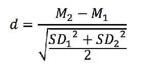

This is a full breakdown of our group's process in creating Table 1. Suitable for rubber ducks.

First, as always, we needed to load in our libraries. We used tidyverse for general coding, dplyr for data wrangling and gt to create and visualise our table!

```{r}
library(tidyverse)
library(dplyr)
library(gt)
```

Next, we loaded in our data using the read.csv function, and labelled it 'data1'. The csv file is located within a folder called data, hence the 'data/'.

```{r}
data1 <- read.csv("data/Nichols_et_al_data.csv")
```

Next, we went about cleaning the original data for easier use. 
With the function 'filter(include == 0)' we included in our data set only those that were eligible and filtered OUT those participants who were excluded from the analysis because they reported suspicion about the goals of the experiment and/or had participated in previous studies using the dots game.
Then, with the 'rename' function we renamed the variables in the table to have them make more sense in relation to what they actually measured and to line them up better with codebook in the OSF.
With the select function we culled the variables in the original data that we had no use for.

```{r}
data1 <- data1 %>% 
  filter(include == 0) %>% 
  rename(cond = con,
         claimpercent = claim,
         claimmoney = moneyclaim,
         CT_practice = completion.time..practice.included.,
         CT_payments = completion.time..payments.only.,
         religiosity = relig,
         religion = Religion) %>% 
  select(-CT_practice, -CT_payments, -CT, -CT_cheat, -Religion.Text, -affil_cong)
```

So, now that the data was tidied, we needed to create new variables as seen in table 1: negativity, positivty, tempo and impact (% claimed and sacredness variables already existed in the raw data set). We consulted the codebook on OSF to find out what exactly these variables were, what they measured and how they were calculated. They all turned out to be averages of variables already existing in the data, serving as a summary of a group of variables.
Interestingly, however, this was not made clear within the paper, and upon reading the paper for the first few times we were quite confused as to where these four variables came from, what they meant and how they were calculated. It could be argued that figures within published papers should not include unexplained measurements that require one to delve deep into computer code to understand them. Beyond this, the computer code itself is rather vague with many statements like "as per Lang et al paper", requiring us to go to the Lang et al paper and find their datasets and calculations. For example, we are still unsure as to why the slow variable is reverse coded using -7 not -6 to create the new tempo variable, and this question is likely only to be answered if we are to contact the original authors themselves. When we talk about open data, open science and reproducibility, we wish to avoid issues such as these.

```{r}
data1 <- data1 %>% 
  mutate(
    negativity = (distressing + irritating + boring + sad)/4,
    positivity = (interesting + pleasant + exciting + relaxing + happy)/5,
    impact = (deep + powerful)/2,
    tempo = (fast + abs(slow-7))/2
  ) 
```

So, now that we had the new variables, we needed to find the descriptive statistics for them (ie the values in the table): means, standard deviations, confidence intervals and Cohen's d's. 

We started by using the group_by and summarise function but quickly realised this was not going to work because while this allowed us to visualise the descriptives, it did not create new values that we could use to input into a table.

```{r}
data1 %>% 
  group_by(cond) %>%
  summarise(mean_claim = mean(claimpercent, na.rm = TRUE),
            mean_sac = mean(sacred, na.rm = TRUE),
            mean_neg = mean(negativity, na.rm = TRUE),
            mean_pos = mean(positivity, na.rm = TRUE),
            mean_imp = mean(impact, na.rm = TRUE),
            mean_temp = mean(tempo, na.rm = TRUE),
            SD_claim = sd(claimpercent, na.rm = TRUE),
            SD_sac = sd(sacred, na.rm = TRUE),
            SD_neg = sd(negativity, na.rm = TRUE),
            SD_pos = sd(positivity, na.rm = TRUE),
            SD_imp = sd(impact, na.rm = TRUE),
            SD_temp = sd(tempo, na.rm = TRUE)
  )
```

So, we consulted the codebook again, which did prove to be helpful despite being confusingly laid-out and despite containing some outdated code. Nevertheless, we came up with the following long piece of code to obtain values for the descriptives (Means, SDs and CIs) of each of the six variables (% claimed, sacredness, negatviity, positivity, tempo, impact) in the table, for each of the four conditions. So the code below is partitioned into six parts for the six variables in the table. For each variable, the code is partitioned into the four conditions (though control group only actually appears in the percent claimed variable because it doesnt apply to the other variables (that is, you can't rate the tempo or impact of no sound)). Then, within each condition there is six lines of code that compute six new values (mean, SD, number of responses, SE, upper and lower CI limit). 

Before we dive into how each descriptive value was calculated, we first want to explain how each value was LABELLED. Each new value was labelled as such: descriptive.conditionnumber.variable, where the control group is (1), white noise group is (2), secular music group is (3), and religious music group is (4). So, lets take 'sd3s' as an example. This is the standard deviation (sd) of the sacredness variable (s) in the secular music group (3). Or, for example, 'mean2i' is the mean of the impact variable (i) for the white noise group (2).

So, to demonstrate how we computed each descriptive for each variable across all the groups, I will use the percent claimed variable and control group (ie group 1) as an example...
First, we obtained the mean, simply using the 'mean' function, with the code within the brackets specifying that we want the mean of all values within in the control group [data$cond=="1"], for the percent claimed variable (claimpercent), which included some NA values with must be discounted, thus (na.rm = TRUE) We multiplied this value by 100 (*100) because it shows in the original data as a decimal place but in the table as a percentage. This command converts the value to a percentage so it can be used in the table, but note that we only did this for the percent claimed variable, because it was the only one that required this conversion from the original data.
Then, we found the SD for all the percent claimed values in the control group, using very similar code for the mean to specify which exact values we wanted the SD to be calculated from, but this time of course using the sd function. Again, we multiplied this value by 100 using (*100).
The next descriptive in the table from the original paper is a confidence interval which requires a measurement of standard error which requires us to calculate n (number of responses in the control group for the percent claimed variable). To do this, the original paper used the length() function, which gets the length of a vector (in this case the list of responses in the control group), but the n() function could also have been used. The !is.na removed NA values from this calculation.
# WHAT is the difference between na.rm and !is.na?
Then, to calculate standard error, which we need to calculate the upper and lower CIs, we took the sd value that we just calculated above and divided that by the square root (sqrt) of n (also just calculated above).
Now that we had the standard error measure, we could plug that into the formula for out upper and lower 95% confidence interval limits.
Thus, we obtained descriptives (mean, SD, CIs) for each variable across each group.

```{r}
# Percent claimed variable
# Control Group (1)
mean1c <- mean(data1$claimpercent[data1$cond=="1"], na.rm = TRUE)*100 # mean
sd1c <- sd(data1$claimpercent[data1$cond=="1"], na.rm = TRUE)*100 # SD
n1c <- length(data1$cond[data1$cond=="1" & !is.na(data1$cond)]) # number of responses
se1c <- sd1c/sqrt(n1c) # standard error
lCI1c <- mean1c - (1.96*se1c) # lower 95% CI
uCI1c <- mean1c + (1.96*se1c) # upper 95% CI
# White Noise Group (2)
mean2c <- mean(data1$claimpercent[data1$cond=="2"], na.rm = TRUE)*100 # mean
sd2c <- sd(data1$claimpercent[data1$cond=="2"], na.rm = TRUE)*100 # SD
n2c <- length(data1$cond[data1$cond=="2" & !is.na(data1$cond)]) # number of responses
se2c <- sd2c/sqrt(n2c) # standard error
lCI2c <- mean2c - (1.96*se2c) # lower 95% CI
uCI2c <- mean2c + (1.96*se2c) #upper 95% CI
# Secular Group (3)
mean3c <- mean(data1$claimpercent[data1$cond=="3"], na.rm = TRUE)*100 # mean
sd3c <- sd(data1$claimpercent[data1$cond=="3"], na.rm = TRUE)*100 # SD
n3c <- length(data1$cond[data1$cond=="3" & !is.na(data1$cond)]) # number of responses
se3c <- sd3c/sqrt(n3c) # standard error
lCI3c <- mean3c - (1.96*se3c) # lower 95% CI
uCI3c <- mean3c + (1.96*se3c) #upper 95% CI
# Religious Group (4)
mean4c <- mean(data1$claimpercent[data1$cond=="4"], na.rm = TRUE)*100 # mean
sd4c <- sd(data1$claimpercent[data1$cond=="4"], na.rm = TRUE)*100 # SD
n4c <- length(data1$cond[data1$cond=="4" & !is.na(data1$cond)]) # number of responses
se4c <- sd4c/sqrt(n4c) # standard error
lCI4c <- mean4c - (1.96*se4c) # lower 95% CI
uCI4c <- mean4c + (1.96*se4c) #upper 95% CI
# Sacredness variable
# White Noise Group (2)
mean2s <- mean(data1$sacred[data1$cond=="2"], na.rm = TRUE) # mean
sd2s <- sd(data1$sacred[data1$cond=="2"], na.rm = TRUE) # SD
n2s <- length(data1$cond[data1$cond=="2" & !is.na(data1$cond)]) # number of responses
se2s <- sd2s/sqrt(n2s) # standard error
lCI2s <- mean2s - (1.96*se2s) # lower 95% CI
uCI2s <- mean2s + (1.96*se2s) #upper 95% CI
# Secular Group (3)
mean3s <- mean(data1$sacred[data1$cond=="3"], na.rm = TRUE) # mean
sd3s <- sd(data1$sacred[data1$cond=="3"], na.rm = TRUE) # SD
n3s <- length(data1$cond[data1$cond=="3" & !is.na(data1$cond)]) # number of responses
se3s <- sd3s/sqrt(n3s) # standard error
lCI3s <- mean3s - (1.96*se3s) # lower 95% CI
uCI3s <- mean3s + (1.96*se3s) #upper 95% CI
# Religious Group (4)
mean4s <- mean(data1$sacred[data1$cond=="4"], na.rm = TRUE) # mean
sd4s <- sd(data1$sacred[data1$cond=="4"], na.rm = TRUE) # SD
n4s <- length(data1$cond[data1$cond=="4" & !is.na(data1$cond)]) # number of responses
se4s <- sd4s/sqrt(n4s) # standard error
lCI4s <- mean4s - (1.96*se4s) # lower 95% CI
uCI4s <- mean4s + (1.96*se4s) #upper 95% CI
# Negativity variable
# White Noise Group (2)
mean2n <- mean(data1$negativity[data1$cond=="2"], na.rm = TRUE) # mean
sd2n <- sd(data1$negativity[data1$cond=="2"], na.rm = TRUE) # SD
n2n <- length(data1$cond[data1$cond=="2" & !is.na(data1$cond)]) # number of responses
se2n <- sd2n/sqrt(n2n) # standard error
lCI2n <- mean2n - (1.96*se2n) # lower 95% CI
uCI2n <- mean2n + (1.96*se2n) #upper 95% CI
# Secular Group (3)
mean3n <- mean(data1$negativity[data1$cond=="3"], na.rm = TRUE) # mean
sd3n <- sd(data1$negativity[data1$cond=="3"], na.rm = TRUE) # SD
n3n <- length(data1$cond[data1$cond=="3" & !is.na(data1$cond)]) # number of responses
se3n <- sd3n/sqrt(n3n) # standard error
lCI3n <- mean3n - (1.96*se3n) # lower 95% CI
uCI3n <- mean3n + (1.96*se3n) #upper 95% CI
# Religious Group (4)
mean4n <- mean(data1$negativity[data1$cond=="4"], na.rm = TRUE) # mean
sd4n <- sd(data1$negativity[data1$cond=="4"], na.rm = TRUE) # SD
n4n <- length(data1$cond[data1$cond=="4" & !is.na(data1$cond)]) # number of responses
se4n <- sd4n/sqrt(n4n) # standard error
lCI4n <- mean4n - (1.96*se4n) # lower 95% CI
uCI4n <- mean4n + (1.96*se4n) #upper 95% CI
# Positivity variable
# White Noise Group (2)
mean2p <- mean(data1$positivity[data1$cond=="2"], na.rm = TRUE) # mean
sd2p <- sd(data1$positivity[data1$cond=="2"], na.rm = TRUE) # SD
n2p <- length(data1$cond[data1$cond=="2" & !is.na(data1$cond)]) # number of responses
se2p <- sd2p/sqrt(n2p) # standard error
lCI2p <- mean2p - (1.96*se2p) # lower 95% CI
uCI2p <- mean2p + (1.96*se2p) #upper 95% CI
# Secular Group (3)
mean3p <- mean(data1$positivity[data1$cond=="3"], na.rm = TRUE) # mean
sd3p <- sd(data1$positivity[data1$cond=="3"], na.rm = TRUE) # SD
n3p <- length(data1$cond[data1$cond=="3" & !is.na(data1$cond)]) # number of responses
se3p <- sd3p/sqrt(n3p) # standard error
lCI3p <- mean3p - (1.96*se3p) # lower 95% CI
uCI3p <- mean3p + (1.96*se3p) #upper 95% CI
# Religious Group (4)
mean4p <- mean(data1$positivity[data1$cond=="4"], na.rm = TRUE) # mean
sd4p <- sd(data1$positivity[data1$cond=="4"], na.rm = TRUE) # SD
n4p <- length(data1$cond[data1$cond=="4" & !is.na(data1$cond)]) # number of responses
se4p <- sd4p/sqrt(n4p) # standard error
lCI4p <- mean4p - (1.96*se4p) # lower 95% CI
uCI4p <- mean4p + (1.96*se4p) #upper 95% CI
# Tempo variable
# White Noise Group (2)
mean2t <- mean(data1$tempo[data1$cond=="2"], na.rm = TRUE) # mean
sd2t <- sd(data1$tempo[data1$cond=="2"], na.rm = TRUE) # SD
n2t <- length(data1$cond[data1$cond=="2" & !is.na(data1$cond)]) # number of responses
se2t <- sd2t/sqrt(n2t) # standard error
lCI2t <- mean2t - (1.96*se2t) # lower 95% CI
uCI2t <- mean2t + (1.96*se2t) #upper 95% CI
# Secular Group (3)
mean3t <- mean(data1$tempo[data1$cond=="3"], na.rm = TRUE) # mean
sd3t <- sd(data1$tempo[data1$cond=="3"], na.rm = TRUE) # SD
n3t <- length(data1$cond[data1$cond=="3" & !is.na(data1$cond)]) # number of responses
se3t <- sd3t/sqrt(n3t) # standard error
lCI3t <- mean3t - (1.96*se3t) # lower 95% CI
uCI3t <- mean3t + (1.96*se3t) #upper 95% CI
# Religious Group (4)
mean4t <- mean(data1$tempo[data1$cond=="4"], na.rm = TRUE) # mean
sd4t <- sd(data1$tempo[data1$cond=="4"], na.rm = TRUE) # SD
n4t <- length(data1$cond[data1$cond=="4" & !is.na(data1$cond)]) # number of responses
se4t <- sd4t/sqrt(n4t) # standard error
lCI4t <- mean4t - (1.96*se4t) # lower 95% CI
uCI4t <- mean4t + (1.96*se4t) #upper 95% CI
# Impact variable
# White Noise Group (2)
mean2i <- mean(data1$impact[data1$cond=="2"], na.rm = TRUE) # mean
sd2i <- sd(data1$impact[data1$cond=="2"], na.rm = TRUE) # SD
n2i <- length(data1$cond[data1$cond=="2" & !is.na(data1$cond)]) # number of responses
se2i <- sd2i/sqrt(n2i) # standard error
lCI2i <- mean2i - (1.96*se2i) # lower 95% CI
uCI2i <- mean2i + (1.96*se2i) #upper 95% CI
# Secular Group (3)
mean3i <- mean(data1$impact[data1$cond=="3"], na.rm = TRUE) # mean
sd3i <- sd(data1$impact[data1$cond=="3"], na.rm = TRUE) # SD
n3i <- length(data1$cond[data1$cond=="3" & !is.na(data1$cond)]) # number of responses
se3i <- sd3i/sqrt(n3i) # standard error
lCI3i <- mean3i - (1.96*se3i) # lower 95% CI
uCI3i <- mean3i + (1.96*se3i) #upper 95% CI
# Religious Group (4)
mean4i <- mean(data1$impact[data1$cond=="4"], na.rm = TRUE) # mean
sd4i <- sd(data1$impact[data1$cond=="4"], na.rm = TRUE) # SD
n4i <- length(data1$cond[data1$cond=="4" & !is.na(data1$cond)]) # number of responses
se4i <- sd4i/sqrt(n4i) # standard error
lCI4i <- mean4i - (1.96*se4i) # lower 95% CI
uCI4i <- mean4i + (1.96*se4i) #upper 95% CI
```

The last descriptive measurement in Table 1 was the Cohen's d variable, measuring the effect size for each of the six variables across conditions, in comparison to the religious condition. We calculated it as such...

The formula for Cohen's d is as follows...


As such, the lines of code below calculate the effect size (Cohen's d) for each variable in the religious music condition in comparison with each variable in the other conditions. The abs() function was added to visualise all the effect sizes as absolute values, as done in the original table. Similarly to the other variables, the labels for the Cohen d effect sizes are labelled in the following manner: d standing for Cohen's d, the number referring to which effect comparison between conditions this variable is measuring (1 = relig vs sec, 2 
= reglig vs noise, 3 = relig vs control), then the final letter represents which of the six variables is being measured (eg n for negativity).

```{r}
# computing Cohen's d
# % claimed
#relig vs sec
d1c <- abs((mean4c-mean3c)/sqrt((sd4c^2+sd3c^2)/2))
#relig vs noise
d2c <- abs((mean4c-mean2c)/sqrt((sd4c^2+sd2c^2)/2))
#relig vs control
d3c <- abs((mean4c-mean1c)/sqrt((sd4c^2+sd1c^2)/2))
# sacredness
#relig vs sec
d1s <- abs((mean4s-mean3s)/sqrt((sd4s^2+sd3s^2)/2))
#relig vs noise
d2s <- abs((mean4s-mean2s)/sqrt((sd4s^2+sd2s^2)/2))
# negativity
#relig vs sec
d1n <- abs((mean4n-mean3n)/sqrt((sd4n^2+sd3n^2)/2))
#relig vs noise
d2n <- abs((mean4n-mean2n)/sqrt((sd4n^2+sd2n^2)/2))
# positivity
#relig vs sec
d1p <- abs((mean4p-mean3p)/sqrt((sd4p^2+sd3p^2)/2))
#relig vs noise
d2p <- abs((mean4p-mean2p)/sqrt((sd4p^2+sd2p^2)/2))
# tempo
#relig vs sec
d1t <- abs((mean4t-mean3t)/sqrt((sd4t^2+sd3t^2)/2))
#relig vs noise
d2t <- abs((mean4t-mean2t)/sqrt((sd4t^2+sd2t^2)/2))
# impact
#relig vs sec
d1i <- abs((mean4i-mean3i)/sqrt((sd4i^2+sd3i^2)/2))
#relig vs noise
d2i <- abs((mean4i-mean2i)/sqrt((sd4i^2+sd2i^2)/2))
```
Now that we have worked out the formula for each data set, we wanted to visualise it into a table. This ensured that we had all the correct values for each group. Firstly, we placed the data into a tibble, starting with the religious sample.

We then listed the characteristics that this table focused on such as % claimed and sacredness before placing the variable names under the appropriate columns. After doing so, we used the mutate_if function to round the values to 2 decimal places. The function is.numeric specifies that this will only apply to columns with numeric values. Finally, we used the GT function to plot it into a table and gave it an appropriate title using cols_label.

```{r eval=FALSE}
print("Don't run me")
#Making the tables
#Make religious table
table1 <- tibble(
  characteristics = c("% claimed", "Sacredness", "Negativity", "Positivity", "Tempo", "Impact"),
  M = c(mean4c, mean4s, mean4n, mean4p, mean4t, mean4i),
  SD = c(sd4c, sd4s, sd4n, sd4p, sd4t, sd4i),
  lCI = c(lCI4c, lCI4s, lCI4n, lCI4p, lCI4t, lCI4i),
  uCI = c(uCI4c, uCI4s, uCI4n, uCI4p, uCI4t, uCI4i),
  d = c("-", "-", "-", "-", "-", "-")
) 
table1 %>% mutate_if(is.numeric, ~round(., 2)) %>%
  gt() %>%
  cols_label(characteristics = "Religious") 
```

We then applied this to the secular, white noise and control groups. The "c" specifies the values of each column, which match up with the characteristics column.

```{r eval=FALSE}
print("Don't run me")
#Make secular table
table2 <- tibble(
  characteristics = c("% claimed", "Sacredness", "Negativity", "Positivity", "Tempo", "Impact"),
  M = c(mean3c, mean3s, mean3n, mean3p, mean3t, mean3i),
  SD = c(sd3c, sd3s, sd3n, sd3p, sd3t, sd3i),
  lCI = c(lCI3c, lCI3s, lCI3n, lCI3p, lCI3t, lCI3i),
  uCI = c(uCI3c, uCI3s, uCI3n, uCI3p, uCI3t, uCI3i),
  d = c(d1c, d1s, d1n, d1p, d1t, d1i)
)
table2 %>% mutate_if(is.numeric, ~round(., 2)) %>%
  gt() %>%
  cols_label(characteristics = "Secular")
#Make white noise table
table3 <- tibble(
  characteristics = c("% claimed", "Sacredness", "Negativity", "Positivity", "Tempo", "Impact"),
  M = c(mean2c, mean2s, mean2n, mean2p, mean2t, mean2i),
  SD = c(sd2c, sd2s, sd2n, sd2p, sd2t, sd2i),
  lCI = c(lCI2c, lCI2s, lCI2n, lCI2p, lCI2t, lCI2i),
  uCI = c(uCI2c, uCI2s, uCI2n, uCI2p, uCI2t, uCI2i),
  d = c(d2c, d2s, d2n, d2p, d2t, d2i)
)
table3 %>% mutate_if(is.numeric, ~round(., 2)) %>%
  gt() %>%
  cols_label(characteristics = "White Noise")
#Make control group table
table4 <- tibble(
  characteristics = c("% claimed", "Sacredness", "Negativity", "Positivity", "Tempo", "Impact"),
  M = c(mean1c, NA, NA, NA, NA, NA),
  SD = c(sd1c, NA, NA, NA, NA, NA),
  lCI = c(lCI1c, NA, NA, NA, NA, NA),
  uCI = c(uCI1c, NA, NA, NA, NA, NA),
  d = c(d3c, NA, NA, NA, NA, NA)
)
table4 %>% mutate_if(is.numeric, ~round(., 2)) %>%
  gt() %>%
  cols_label(characteristics = "Control Group")
```

After this, we needed to merge the tables together. I found that using the data.frame was the easiest. It collected all the variables from all four tables, and made a collection that was similar to a matrix. 

```{r eval=FALSE}
print("Don't run me")
data_tables <- data.frame(Religious = table1, 
                          Secular = table2,
                          WhiteNoise = table3,
                          Control = table4)
```

Building upon that, we used the function gt(data_tables) to have R understand what data frame we wanted to use. By inputting the function tab_source_note(source_note = ...), we were able to place text at the bottom of the table, similar to the original. The function tab_spanner(label = ...,columns = c()) allowed us to place a label that spans across a certain amount of columns. This enabled us to label the columns that pertain to each group. 

```{r eval=FALSE}
print("Don't run me")
gt_tbl <- gt(data_tables) %>% 
  tab_source_note(
    source_note = "M = Mean; SD = Standard Deviation; CI = 95% Confidence Intervals. Cohen's d represents the effect size of comparisons between musical conditions.") %>%
  tab_spanner(
    label = "Religious (n = 102)",
    columns = c(Religious.M, Religious.SD, Religious.lCI, Religious.uCI, Religious.d)
  ) %>%
  tab_spanner(
    label = "Secular (n = 103)",
    columns = c(Secular.M, Secular.SD, Secular.lCI, Secular.uCI, Secular.d)
  ) %>%
  tab_spanner(
    label = "White Noise (n = 103)",
    columns = c(WhiteNoise.M, WhiteNoise.SD, WhiteNoise.lCI, WhiteNoise.uCI, WhiteNoise.d)
  ) %>%
  tab_spanner(
    label = "Control (n = 100)",
    columns = c(Control.M, Control.SD, Control.lCI, Control.uCI, Control.d)
  )
```

Moving on from this, we needed to name the columns appropriately with M, SD, lCI, uCI and d. This was completed using the function cols_label, where the original name of the column is overridden, and the words in the speech marks ("") set the new name.

```{r eval=FALSE}
print("Don't run me")
cols_label(Religious.characteristics = NULL, 
             Religious.M = "M",
             Religious.SD = "SD",
             Religious.lCI = "lCI",
             Religious.uCI = "uCI",
             Religious.d = "d",
             Secular.characteristics = "Secular",
             Secular.M = "M",
             Secular.SD = "SD",
             Secular.lCI = "lCI",
             Secular.uCI = "uCI",
             Secular.d = "d",
             WhiteNoise.characteristics = "White Noise",
             WhiteNoise.M = "M",
             WhiteNoise.SD = "SD",
             WhiteNoise.lCI = "lCI",
             WhiteNoise.uCI = "uCI",
             WhiteNoise.d = "d",
             Control.characteristics = "Control",
             Control.M = "M",
             Control.SD = "SD",
             Control.lCI = "lCI",
             Control.uCI = "uCI",
             Control.d = "d")
```

We needed to ensure that all values were rounded to two decimal places. This was achieved using fmt_number on columns with numeric values. This was difficult for values that were marked with a "-" initially, as they were not calculated by the researchers. By coming back to the original table visualisation and changing the "-" into NA, the function fmt_number finally worked. This was applied to each column and use_seps was set to false as we did not want any digit group separators. The exact function is: fmt_number(columns = ..., decimals = 2, use_seps = FALSE).

```{r eval=FALSE}
print("Don't run me")
  fmt_number(
    columns = c(Religious.M, Religious.SD, Religious.lCI, Religious.uCI, Secular.M, Secular.SD, Secular.lCI, Secular.uCI, Secular.d, WhiteNoise.M, WhiteNoise.SD, WhiteNoise.lCI, WhiteNoise.uCI, WhiteNoise.d, Control.M, Control.SD, Control.lCI, Control.uCI, Control.d),
    decimals = 2,
    use_seps = FALSE
  )
```

Next on the list was hiding columns that repeated the %%claimed, sacredness, negativity, positivity, tempo and impact characteristics. This occurred as each group initially had their own separate table. We achieved this by using the function cols_hide(columns = c(...)).

```{r eval=FALSE}
print("Don't run me")
cols_hide(
    columns = c(Secular.characteristics, WhiteNoise.characteristics, Control.characteristics))
```

Finally, the last thing to do was change the NA's in our GT table to "-" to visualise it similarly to Nichols and colleagues. This was done using the function fmt_missing and applying it to every column. The missing_text function replaced the NA's with "-". And now our work was finally done!

```{r eval=FALSE}
print("Don't run me")
gt_tbl %>% fmt_missing(
  columns = everything(),
  missing_text = "-"
```